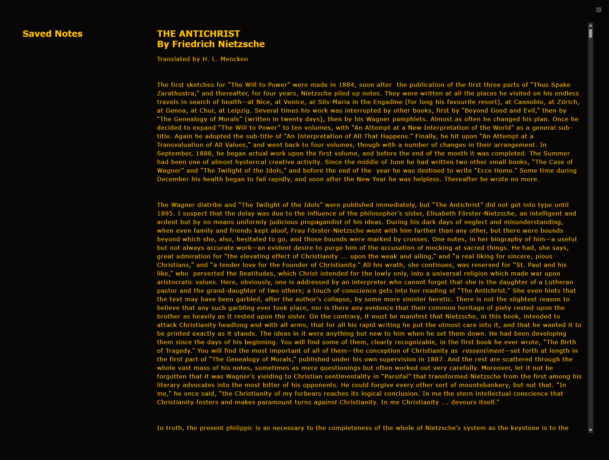
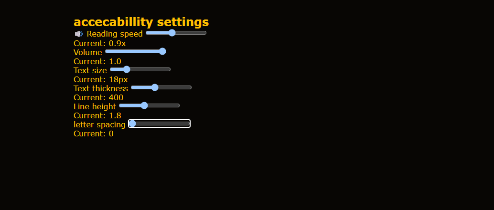
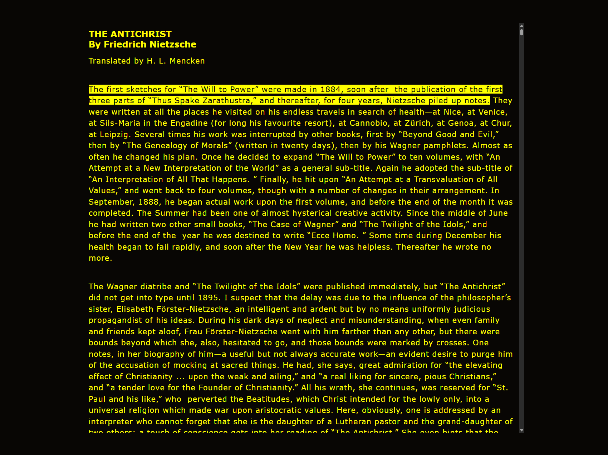
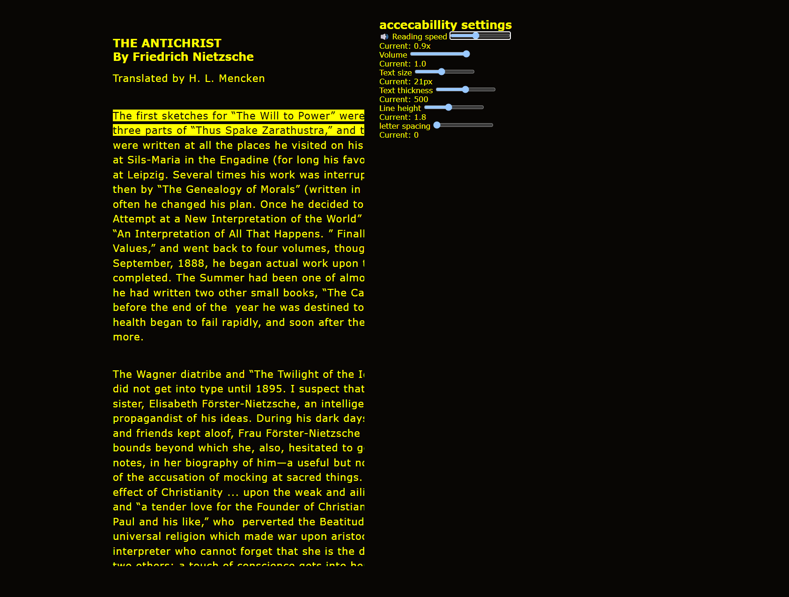
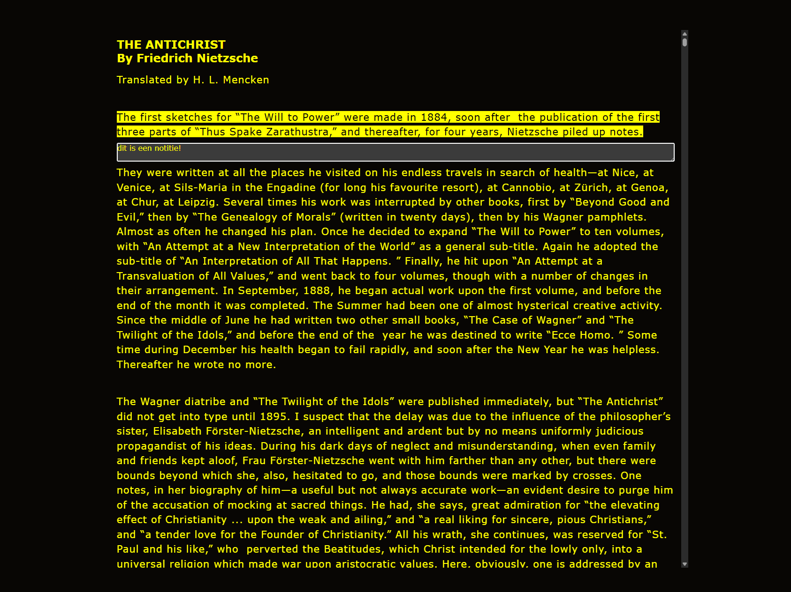
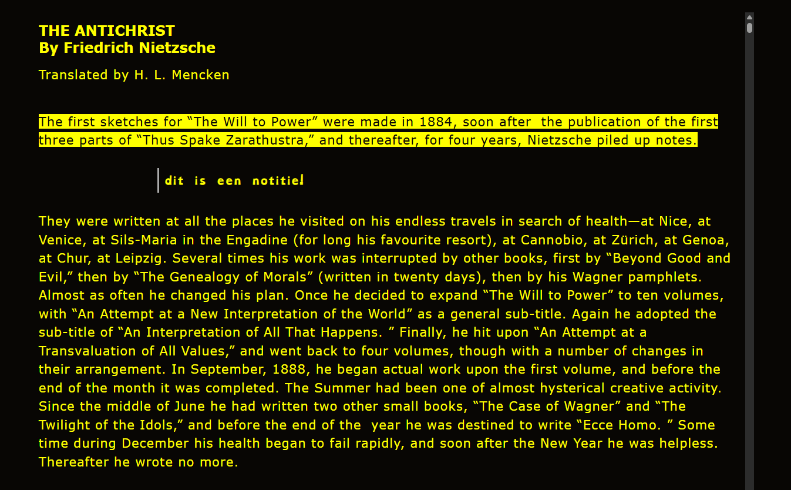
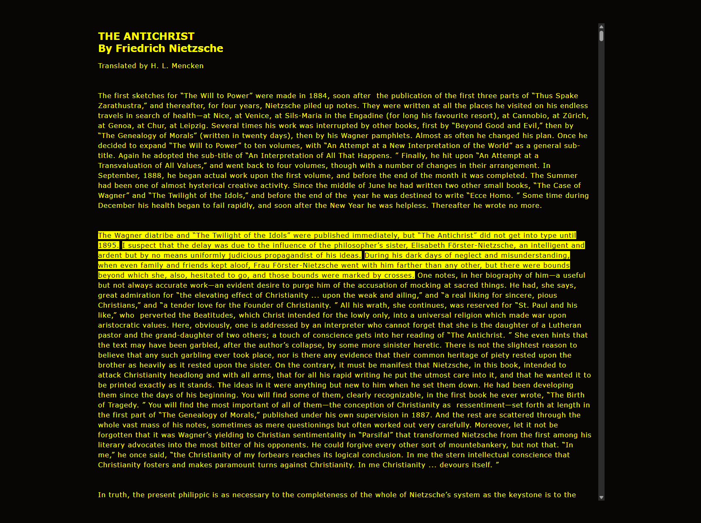

# usertech readme
In dit vak zal ik een applicatie gaan maken voor roger. roger is iemand die blind is in een oog en slechtziend in de ander. Hierom wilt hij graag voor zijn nieuwe studie in literatuur een applicatie die teksten voor hem voor kan lezen en waarmee hij aantekeningen kan maken. Dit ging in 4 sprints waarbij we wekelijks gingen testen of de applicatie was wat roger wou hebben en of hij er comfortabel mee kon werken. 

## week 1
Week 1 had ik moeten missen omdat ik ziek was. In de dagen daarna heb ik wel zo veel mogelijk proberen te leren over roger door te praten met andere leerlingen die hem wel hadden gesproken. Hierbij leerde ik dat roger erg graag de applicatie wilde hebben met gele tekst en een zwarte achtergrond aangezien hij dit het beste nog kon waarnemen. Hiernaast had ik een idee van wat ik de volgende week zou willen testen.

## Week 2
#### Wat ik tot nu toe had gemaakt
In het weekend voorafgaand aan week 2 had ik een eerste versie van mijn applicatie gebouwd. Deze applicatie kon teksten voorlezen en had de mogelijkheid om tijdens het luisteren notities te maken. Wanneer je op de "n"-toets drukte, werd er een notitie toegevoegd. Deze notities werden opgeslagen in een apart menu, dat je kon openen door op de "m"-toets te drukken. In dit menu kon je de notities teruglezen én laten voorlezen.

Daarnaast had ik een eenvoudig toegankelijkheidsmenu toegevoegd waarin de gebruiker zaken kon aanpassen zoals de lettergrootte, dikte van het lettertype en de afstand tussen de letters (letter spacing).

Om de voorleesfunctionaliteit realistisch te testen, had ik gekozen voor een echte tekst: De Antichrist van Nietzsche. Dit zou een voorbeeld kunnen zijn van wat Roger – de gebruiker waarvoor ik ontwerp – daadwerkelijk zou willen lezen.

Zo zag de eerste versie van de applicatie eruit:

En hier zie je het toegankelijkheidsmenu:

#### Mijn doel deze week
Mijn voornaamste doel in week 2 was om te testen hoe goed Roger nog kon zien en in hoeverre een toegankelijkheidsmenu daadwerkelijk noodzakelijk was. Daarnaast wilde ik in kaart brengen hoe handig hij was met technologie, en hoe hij de applicatie tot nu toe ervoer. Het was belangrijk om te achterhalen of de huidige interface werkte of juist obstakels opleverde.

#### De test met Roger
Tijdens de eerste echte gebruikerssessie leerde ik ontzettend veel over Roger en zijn situatie. Hij is op latere leeftijd opnieuw gaan studeren en ervaart veel moeite bij het maken van aantekeningen en het schrijven van papers. Hiervoor gebruikte hij Microsoft Word, maar hij gaf aan dat hij navigeren met enkel een toetsenbord erg lastig vond. Bovendien kan hij (nog) niet blind typen, wat de interactie met software uitdagend maakt.

Deze inzichten waren erg waardevol. Zo merkte ik dat de knoppen voor notities en navigatie in mijn applicatie voor Roger moeilijk te vinden waren. Hij gaf aan dat hij vooral de “f”- en “j”-toetsen goed kon herkennen, omdat daar voelbare puntjes op zitten – een standaard hulpmiddel bij het leren blind typen. Dat bracht me op het idee om deze toetsen te gebruiken voor belangrijke functionaliteiten.

Verder vertelde Roger over zijn werkwijze. Hij voegt vaak commentaar of ideeën direct toe in de lopende tekst, in plaats van in de kantlijn of in aparte notitieblokken. Toen ik hem vroeg of hij liever de notities geïntegreerd in de tekst zou willen zien, reageerde hij enthousiast. Dit gaf mij meteen inspiratie voor verbeteringen voor de volgende versie van de applicatie.

Tot slot was hij erg te spreken over het toegankelijkheidsmenu. Hij vond het fijn om zelf de controle te hebben over de weergave van de tekst. Wat hij nog miste, was controle over de hoeveelheid tekst die per keer werd voorgelezen. De applicatie las in de eerste versie steeds hele paragrafen voor, maar Roger gaf aan dat hij liever één zin per keer wilde horen, zodat hij zich beter kon concentreren.

#### Belangrijke inzichten uit de test
Uit deze test met Roger kwamen een aantal duidelijke actiepunten naar voren:

- Gebruik van voelbare toetsen: De “f” en “j” toetsen zijn gemakkelijk te herkennen voor Roger. Deze kunnen dus het beste gebruikt worden voor belangrijke functies.

- Toegankelijkheidsmenu is essentieel: Het kunnen aanpassen van lettergrootte, dikte en spacing gaf Roger het gevoel van controle.

- Meer controle over voorleesblokken: In plaats van paragrafen wil Roger liever zinnen laten voorlezen, met duidelijke markering van wat er op dat moment wordt voorgelezen.

- Notities integreren in de tekst: In plaats van een apart notitiemenu, wil Roger zijn aantekeningen liever direct in de tekst opnemen 

## week 3
#### Wat ik tot nu toe had gemaakt
In week 3 had ik de tijd om de feedback van de vorige test uitgebreid te verwerken. De test met Roger stond gepland op donderdag, waardoor ik een aantal dagen had om de applicatie grondig te verbeteren en door te ontwikkelen. Aan het einde van de week was de applicatie aanzienlijk veranderd en klaar voor een nieuwe test.

Alle inzichten uit week 2 waren inmiddels geïmplementeerd. De notities worden nu direct in de tekst geplaatst, wat aansluit op Roger’s voorkeur. Het toegankelijkheidsmenu is verder uitgebreid met nieuwe instellingen zoals het aanpassen van de snelheid en het volume van de screenreader. Ook heb ik een functie toegevoegd waarmee gebruikers zelf de lengte van de tekstblokken die voorgelezen worden kunnen instellen.

Daarnaast heb ik de activeringstoetsen aangepast naar de "f" en "j" toetsen, omdat deze voor Roger voelbaar zijn dankzij de puntjes op de toetsen – ideaal voor gebruikers die niet blind kunnen typen.

Ook de visuele ondersteuning tijdens het voorlezen is flink verbeterd:
- De zin die op dat moment wordt voorgelezen is nu geel gemarkeerd, zodat de gebruiker goed kan volgen waar de focus ligt.
- Navigatie kan via Tab (volgende paragraaf) en de pijltjestoetsen (volgende/vorige zin).
Hieronder enkele voorbeelden van hoe de applicatie er nu uitziet in verschillende “states”:

Startscherm met gemarkeerde zin

Toegankelijkheidsmenu geopend met de “f”-toets

Notitieveld geopend met de “j”-toets

Ingevoegde notitie in de tekst
De notitie wordt iets groter weergegeven en is iets naar rechts uitgelijnd, zodat deze visueel goed te onderscheiden is van de originele tekst.

Instellen van het aantal te markeren zinnen (1 t/m 9)
Hier zie je bijvoorbeeld het effect als je “3” indrukt:

#### Mijn doel deze week
Deze week stond in het teken van valideren: werken de aanpassingen in de praktijk net zo goed als in mijn hoofd? Ik wilde specifiek testen of het noteren ín de tekst ook echt handig en prettig werkt voor Roger, en hoe hij de algehele navigatie van de applicatie ervaart.

Daarnaast wilde ik bepalen of de applicatie al ver genoeg was ontwikkeld om daadwerkelijk bruikbaar te zijn voor zijn studie – zónder dat Roger zijn werk opnieuw in Word moet overzetten. Mijn doel was om tegen het einde van de week een versie te hebben waarmee Roger zijn teksten direct kan inleveren.

#### De test met Roger
De derde test verliep erg goed. Roger had nauwelijks kritiek en gaf aan dat hij de nieuwe manier van noteren erg fijn vond. Het was voor hem duidelijk wat notities waren en wat originele tekst was, en hij dacht dat hij hiermee gemakkelijk zijn opdrachten zou kunnen inleveren.

Wat hij wel opmerkte:
- De gele markering was voor hem iets te donker; hij gaf aan liever een lichtere gele kleur te willen voor betere zichtbaarheid.
- Hij miste nog een mogelijkheid om woorden in de tekst te selecteren en daar apart een notitie bij te maken, bijvoorbeeld om termen te verklaren of begrippen toe te lichten.
Hoewel deze nieuwe wensen waardevol zijn, besloot ik – gezien de beperkte tijd – om me te focussen op één concrete uitbreiding: het exporteren van de tekst met notities naar een Word-bestand. Dat zou de applicatie namelijk echt bruikbaar maken als volwaardig studiehulpmiddel.

Hier is nog een video van de test:
<video controls>
    <source src="./images/vid.mp4" type="video/mp4">
    Your browser does not support the video tag.
</video>

#### Belangrijke inzichten uit de test
- Kleurcontrast: De gele highlight moet lichter en beter zichtbaar zijn voor gebruikers met verminderd zicht.
- Contextuele notities: Roger wil graag woorden in de tekst kunnen selecteren en hier losse notities aan kunnen koppelen.
- Functionaliteit is bijna klaar voor gebruik: Roger zou de applicatie in de huidige staat al kunnen gebruiken voor zijn studieopdrachten – mits exporteren naar Word goed werkt.

## week 4
#### Wat ik tot nu toe had gemaakt
Er zat niet veel tijd tussen week 3 en week 4, maar ik had een duidelijk plan: de applicatie moest de mogelijkheid krijgen om de tekst – inclusief notities – als Word-document te downloaden. Ondanks dat het even zoeken en uitproberen was, is het gelukt. Door op de "d" toets te drukken, kan de gebruiker nu de volledige tekst met notities exporteren als .docx-bestand.

Daarnaast had ik nog de gele markering aangepast naar een lichtere tint, zoals Roger had voorgesteld tijdens de vorige test. Daarmee was ik klaar voor de laatste testronde.

#### Mijn doel deze week
Het doel van deze week was om nog een laatste keer alle functionaliteiten door te lopen en het gevoel te krijgen hoe de tool aanvoelt in gebruik. Ik wilde daarnaast met Roger bespreken wat hij eventueel nog zou willen toevoegen, mocht ik in de toekomst verder willen ontwikkelen aan dit project.

#### De test met Roger
De vierde en laatste test heb ik vrij beknopt gehouden. Roger was opnieuw enthousiast en gaf aan dat hij het downloaden van de tekst als Word-bestand erg gaaf vond. Daarmee werd voor hem duidelijk dat de tool ook echt toepasbaar is voor zijn studie – zonder dat hij alles opnieuw hoeft over te typen.

Hij had nog één belangrijke suggestie:
- Hij zou graag een zijbalk met een overzicht van headings willen, zoals ook in Word, zodat hij bij langere teksten sneller kan navigeren door op een kopje te klikken.
Daarnaast gaf hij aan dat de nieuwe, lichtere gele markering een stuk prettiger was om naar te kijken dan de vorige. Daarmee was de test succesvol afgesloten en kon ik mijn project afronden.

#### wat ik nog verder had willen doen
Als ik meer tijd had gehad, waren er nog een aantal verbeteringen die ik graag had willen doorvoeren:
- Visueel markeren van paragrafen met notities, zodat het meteen duidelijk is waar een notitie bij hoort.
- Meer controle geven over wat genoteerd kan worden, bijvoorbeeld door specifieke woorden of zinnen te selecteren.
- Een legenda of inhoudsopgave toevoegen aan de zijkant, zodat de gebruiker via headings gemakkelijk door de tekst kan navigeren – precies zoals Roger had voorgesteld.
Hoewel er dus nog ruimte is voor uitbreiding, ben ik tevreden met het resultaat dat ik in deze vier weken heb bereikt. De applicatie is functioneel, getest met een gebruiker, en bevat meerdere goed doordachte toegankelijkheidsopties. Natuurlijk kan het altijd beter, maar voor de tijd die ik had ben ik trots op wat er nu staat.